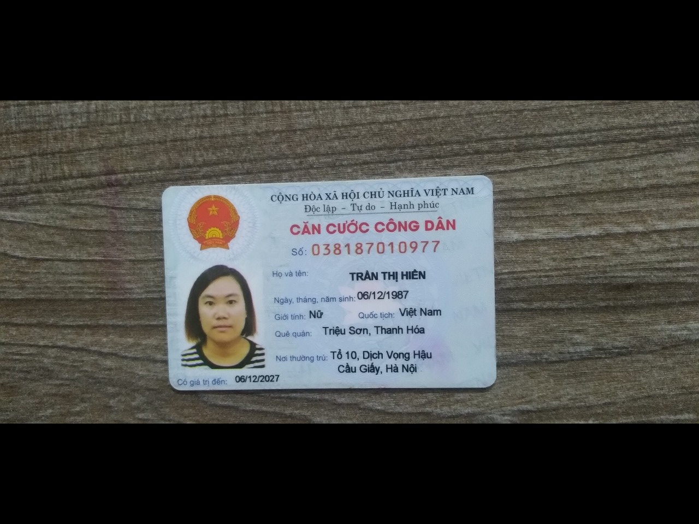
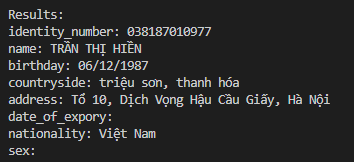
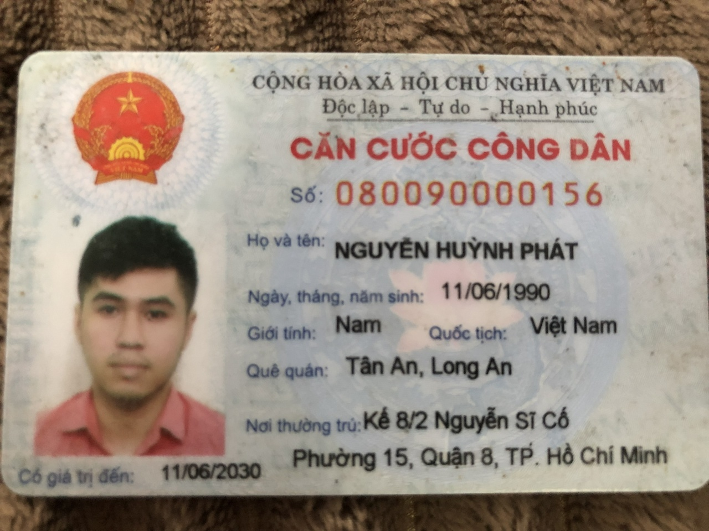
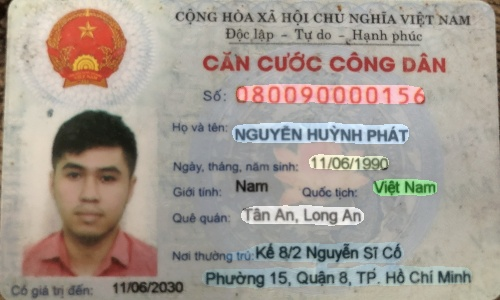
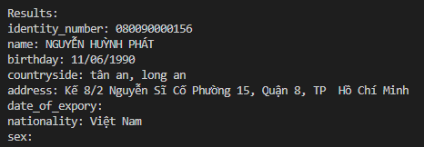
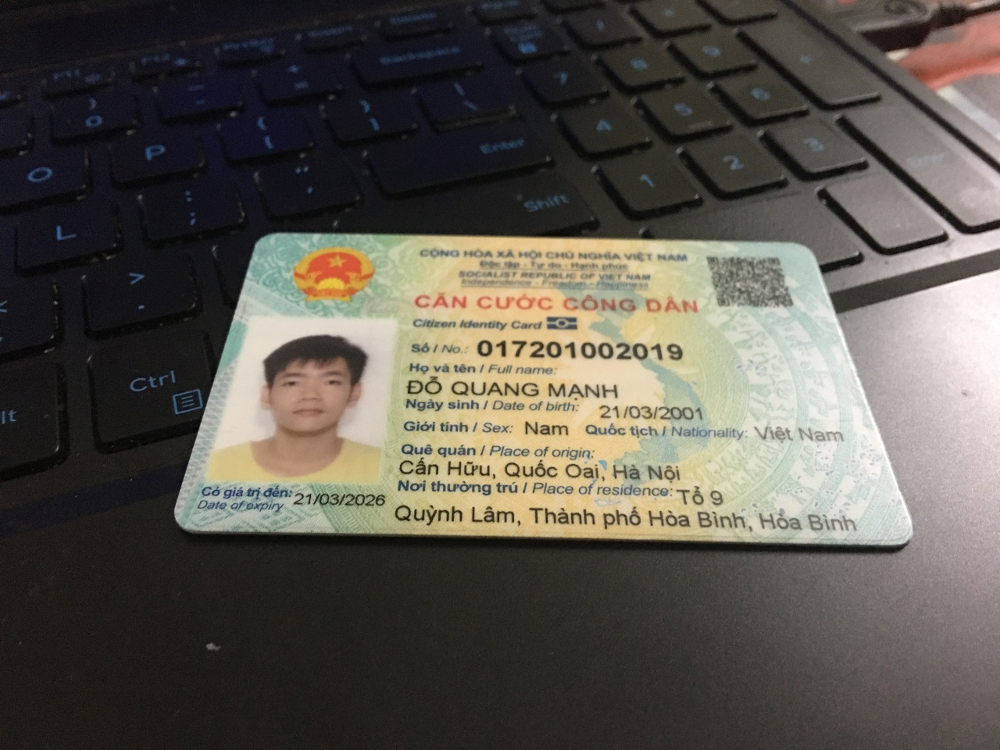
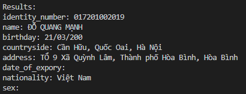

# <div align="center">ID_Card_Information_Extraction</div>


## <div align="center">Introduction</div>

The sources is used for extracting information from ID card. With very limited data, I only try with old Vietnamese identity cards, the data mainly collected from id card on various pages from whom lost their identity cards. Though the data is still very limited, I tried use some blending function for generation to generate more data for training.

The pineline of this sources consists of 3 steps:

1. Detect 4 corners of the card by keypoints, warp them in a straight alignment

2. Use segmentation for line detection fo extract the boundary of each type of info
    - Front Face
        - id identity
        - name
        - birthday
        - countryside
        - address
        - sex (for cccd)
        - nationality (for cccd)
        - date_of_expory (for cccd)
    - Back Face (Upcoming...)

3. Use OCR to read the text for each type of info


## <div align="center">Work flow</div>


## <div align="center">Quick Start Tutorial</div>

<details open>
<summary>Prepare checkpoints</summary>
You should download each checkpoint for each module and place it in its ckpts path according to the pretrained models I prepare in here.

---

**Keypoint detection**
|     Module type    |         Chung Minh Thu         |      Can Cuoc Cong Dan     |
|--------------------|--------------------------------|----------------------------|
|  **Link download** |    [Google Drive](https://drive.google.com/drive/folders/1v9kDHi7SmlMSuT0LEx3F_Nr9zBn_zpTb?usp=sharing) / [One Drive](https://1drv.ms/u/s!AlNB7KJjl-eBg3SUBc0D9z1OOGu9?e=XT3aQ4)    |  [Google Drive](https://drive.google.com/drive/folders/12JJRSOCVW8WniezsS0aTBaItYiCTTNUI?usp=sharing) / [One Drive](https://1drv.ms/u/s!AlNB7KJjl-eBg3PKyze5RxIuYFLi?e=Kr4LgH)  |

---

**Line detection**
|     Module type    |            Chung Minh Thu            |      Can Cuoc Cong Dan     |
|--------------------|--------------------------------------|----------------------------|
|       **FPN**      |       [Google Drive](https://drive.google.com/drive/folders/1aiU5AUNsMim2f4P9Kwrd-Znw_Sjlju1G?usp=sharing) / [One Drive](https://1drv.ms/u/s!AlNB7KJjl-eBhAWn0lVIMYVCVIJ3?e=PkBwmA)       |  [Google Drive](https://drive.google.com/drive/folders/1VS_kMNgmktoXnxBe7AEmcgdEq1kOXDTk?usp=sharing) / [One Drive](https://1drv.ms/u/s!AlNB7KJjl-eBhATGXebOFlVk300Z?e=dm8KqV)  |
|       **PAN**      |       Google Drive / One Drive       |  Google Drive / One Drive  |

---

**OCR**
|     Module type    |            VietOCR            |
|--------------------|-------------------------------|
|   **VGG_Seq2Seq**  |   [Google Drive](https://drive.google.com/drive/folders/1oiD5jUv-LNnS_JRcSzmxxISjwAA0xOdh?usp=sharing) / [One Drive](https://1drv.ms/u/s!AlNB7KJjl-eBhGD-qkL1M6hxE9x1?e=n1MSUI)    |
|**VGG_Transformer** |   [Google Drive](https://drive.google.com/drive/folders/128Y70MMYG7ePzrpT49izJvQ0yyi_ZAKO?usp=sharing) / [One Drive](https://1drv.ms/u/s!AlNB7KJjl-eBhGGsOgLfoCXPPjh4?e=eaLMOA)    |

---


Example save checkpoints
```
ckpts
|-- keypoint_detector_weights
|   |-- cmt_final_500m_kpts_weights
|   |   |-- best.pth
|   |   `-- config.py
|   |-- cmt_final_500m_kpts_weights
|   |   |-- best.pth
|   |   `-- config.py
|   `-- ...
|
|-- line_detector_weights
|   `-- FPN
|       |-- cmt_resnet50
|       |   |-- best_model.pth
|       |   `-- label_map.txt
|       |-- cccd_resnet50
|       |   |-- best_model.pth
|       |   `-- label_map.txt.py
|       `-- ...
|
|-- information_extractor_weights
|   |-- vgg_seq2seq
|   |   `-- seq2seqocr.pth
|   |-- vgg_transformer
|   |   `-- transformerocr.pth
|   `-- ...

keypoint_detection

line_detection

...
```


</details>


<details open>
<summary>Set up dependencies</summary>

## **For cuda usage**

Set up new conda environment

```bash
conda create -n id_card python=3.9.11
conda activate id_card
```

Install cudatoolkit according to your current cuda version. Here I install cudatoolkit 11.3.0 according to my current cuda

```bash
conda install cuda -c nvidia
conda install cuda -c nvidia/label/cuda-11.3.0
```

Install suitable pytorch libraries and install several dependencies

```bash
conda install pytorch==1.11.0 torchvision==0.12.0 torchaudio==0.11.0 cudatoolkit=11.3 -c pytorch
pip install -r requirements.py
```

## **For cpu usage only**

Set up new conda environment

```bash
conda create -n id_card python=3.9.11
conda activate id_card
```

Install suitable pytorch libraries and install several dependencies

```bash
conda install torch torchvision torchaudio
pip install -r requirements.py
```

</details>

<details open>
<summary>Card Extractor Package</summary>

**Initialize the package**

```python
from CardExtractor import CardExtractor

cmt_extractor = CardExtractor(hyps_file='hyps/cmt_default_hyps.yaml') # for Chứng minh thư
cccd_extractor = CardExtractor(hyps_file='hyps/cccd_default_hyps.yaml') # for Căn cước công dân
```

The package reading hyperparameters from hyps file input. Then you can use the package for scanning information from id card with some options.

Hyps file is in hyps folder, you can read the description and change the parameters, checkpoints for all models contained in ckpts folder, you can choose checkpoint for each model from that folder.

Hyps file format:

```yaml
# kpts model options
use_kpts_model: True
kpts_checkpoint: 'ckpts/keypoint_detector_weights/cccd_final_500m_kpts_weights'  # keypoint ckpt model dir
kpts_thr: 0.6  # kpts confidence threshold
kpts_out_width: 500  # kpts output width
kpts_out_height: 300 # kpts output height

# line model options
labelmap: 'ckpts/line_detector_weights/FPN/cccd_resnet50/labelmap.txt'  # label infos file
line_model_bacbone: 'resnet50'  # line model backbone
line_model_encoder_pretrained: 'imagenet'  # line model pretrained for backbone
line_checkpoint: 'ckpts/line_detector_weights/FPN/cccd_resnet50'  # line ckpt model dir
ignores_list: ['background', 'bg']  # ignored class from labelmap

# ocr model options
ocr_config_name: 'vgg_seq2seq'
# ocr_config_name: 'vgg_transformer'
ocr_weights: 'ckpts/information_extractor_weights/vgg_seq2seq/seq2seqocr.pth'

# other options
save_dir: 'runs'  # save directory for information extraction
no_gpu: True   # unable gpu
delay: 60  # delay time for real time scanning

return_kpts_coords: False
return_segment_coords: False
return_card_information: True
print_infos: True
quantity: 20
batch_size: 8
```

**Scanning from one image**

Used for scanning just one image from input.

```python
card_infos = cccd_extractor.scan_from_img('path/to/img.jpg')
```

**Mini note**
Since kpts model not so good and if the card very near the camera lens, you can set this option `False` to not use kpts model, otherwise set `True`

card_infos output example:

|     Input image    |            Output layout            |      Output results     |
|--------------------|-------------------------------------|-------------------------|
||||
||||
||||

**Scanning from images directory**

Used for scanning all images in particular directory.

Usage is similar to scanning from one image, just change image path to images directory.

```python
scanned_informations_list = card_extractor.scan_from_dir('path/to/imgs_dir')
```

Output is list of informations extracted from each image in directory.

**TODO:**
- [ ] Scanning from cam
- [ ] Scanning from webcam
- [ ] Clean code (still lot of leftover dirty code)
- [ ] Add PAN for line detection

</details>
